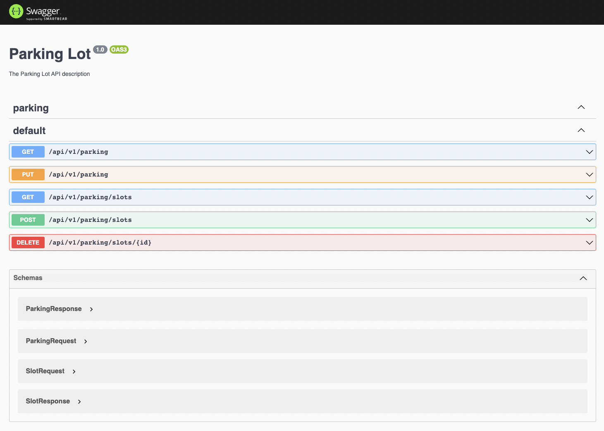

# Parking Lot

#### The following are used in the project
- NestJS
- Swagger API Documentation
- Docker

### Algorithms
- `Priority Queue (min)` is used for the nearest parking slot allocation to achieve the best time complexity

- `Map<>` is used as a in-memory database to store the parking slots details

- `Set<>` is used to hold the unique vehicle registration numbers


## Docker
Build the docker image
```bash
$ docker build -t parking-lot .
```

Run the container
```bash
$ docker run -p3000:3000 parking-lot
```

Browse the API swagger documentation:
```bash
http://localhost:3000/api
```

## Local
### Installation

```bash
$ npm install
```

### Running the app

```bash
$ npm run start
```

### Test

```bash
# unit tests
$ npm run test
```

#### Author - Nihal Mallad
